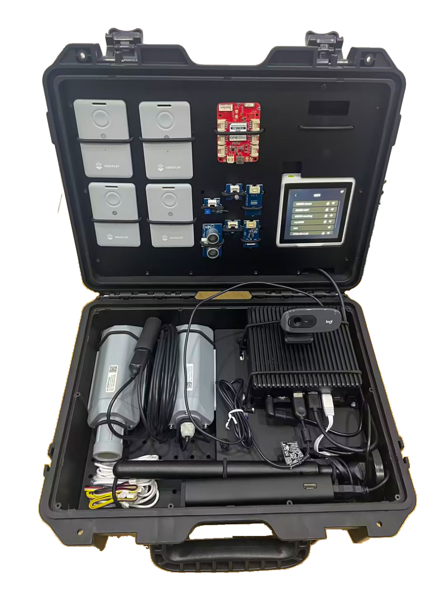
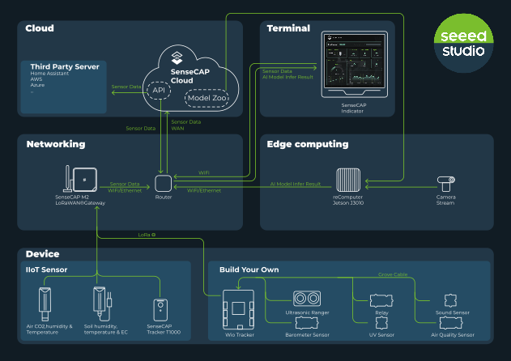
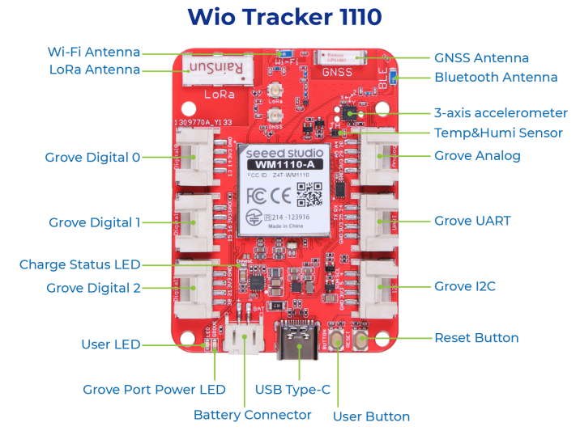

# Hazard-Response-Mission-Pack

Equipping You Today for a Safer Tomorrow

#### Seeed is giving away 5 Kits for free! apply to be selected before the end of this first batch!

### Description:

Hazard Response Mission Pack is an ongoing research project designed for optimized disaster preparedness[1], management, and response. 

This pack includes robust devices for data transmission, data processing,  user interface, precise tracking, intelligent visual analysis, and custom sensor development for environmental monitoring. 

The goal of this research project is to provide a robust yet flexible system for real-time data collection, analysis, and response, enabling efficient management and mitigation of hazard situations. **For this reason the content of the kit may vary in the future, based on the testing of the users and the feedback here. We have just rolled out v 0.2**

[1] WFP defines emergency preparedness as “Actions, arrangements, and procedures in anticipation of an emergency to ensure that the response when needed, be rapid, appropriate and effective.” (Source: [WFP’s Programme Guidance Manual, page 10](https://documents.wfp.org/stellent/groups/public/documents/resources/wfp251892.pdf))

### Architecture:

### Part list v 0.2

The  Hazard Response Mission Pack consists of five different cornerstones of our SenseCAP family products offer: 

* **A LoRaWAN gateway**, allowing sensors to communicate with a node and broadcast their readings to SenseCAP Cloud or your favorite Cloud
* **SenseCAP S2103 LoRaWAN® CO2, Temperature, and Humidity and SenseCAP S2105** - **LoRaWAN® Soil Moisture, Temperature and EC Sensor**
* **Wio Tracker 1110** and several Grove Sensors to make your own tracking device. 
* **reComputer J3010-Edge** AI Device with NVIDIA Jetson Orin™ Nano 4GB module with webcam and several pre-trainsed models, to bring TinyML machine learning to the edge
* **Multiple SenseCAP T1000 LoRaWAN Trackers**, able to monitor movements and activities on the field
* **SenseCAP Indicator** to visualize the data

This kit addresses small independent groups of individuals (or even one person team) willing to monitor and record natural events and bring them online, for community and scientific purposes, with the idea of learning to prevent big disasters and casualties.

| Number | Product Name                                                             | SKU       |
| ------ | ------------------------------------------------------------------------ | --------- |
| 1      | SenseCAP M2 Multi-Platform LoRaWAN Indoor Gateway(SX1302) - EU868        | 114992981 |
| 2      | SenseCAP S2103 LoRaWAN® CO2, Temperature, and Humidity                   | 114992869 |
| 3      | SenseCAP S2105 - LoRaWAN® Soil Moisture, Temperature and EC Sensor       | 114992871 |
| 4      | reComputer J3010-Edge AI Device with NVIDIA Jetson Orin™ Nano 4GB module | 110110146 |
| 5      | Wi-Fi Router                                                             |           |
| 6      | SenseCAP Indicator                                                       | 114993068 |
| 7      | Logitech C270 USB camera                                                 |           |
| 8      | SenseCAP T1000 Tracker x4                                                | 114993073 |
| 9      | Wio Tracker 1110                                                         |           |
| 10     | Grove - Ultrasonic Ranger                                                | 101020010 |
| 11     | Grove - Relay                                                            | 103020005 |
| 12     | Grove - I2C Hub                                                          | 103020006 |
| 13     | Grove - High Precision Barometer Sensor (DPS310)                         | 101020812 |
| 14     | Grove - Air Quality Sensor(SGP41)                                        | 101021092 |
| 15     | Grove - Sound Sensor                                                     | 101020023 |
| 16     | Grove – UV Sensor                                                        | 101020089 |

### Build Your Own Sensor with WIO Tracker -- WIO Tracker + GROVE Sensors

### Jump into the workd of Conputer Vision and Edge AI

You can switch the AI inference Model preinstalled on the device by click the AI Model. The list of models are:

| **Model Name**        | Details                                                                                                                                                                                                                 |
| --------------------- | ----------------------------------------------------------------------------------------------------------------------------------------------------------------------------------------------------------------------- |
| COCO Dataset          | 79 labels can be found here [https://github.com/ultralytics/ultralytics/blob/main/ultralytics/cfg/datasets/coco.yaml](/D:/sensecap/Advanced%20Perception%20Systems/Hazard%20Response%20Mission%20Pack/text)             |
| Containers Detection  | [Containers Detection Object Detection Dataset (v1, 2022-10-18 7:55pm) by One14 Intelligence](/D:/sensecap/Advanced%20Perception%20Systems/Hazard%20Response%20Mission%20Pack/text)                                     |
| Crowd                 | [CrowdHuman Object Detection Dataset (v6, 2023-06-27 11:58am) by Muhammad Suzaki Zahran](/D:/sensecap/Advanced%20Perception%20Systems/Hazard%20Response%20Mission%20Pack/text)                                          |
| Fall Detection        | [Fall Detection Object Detection Dataset (v4, resized640_aug3x-ACCURATE) by Roboflow Universe Projects](/D:/sensecap/Advanced%20Perception%20Systems/Hazard%20Response%20Mission%20Pack/text)                           |
| Forest Fire and Smoke | [Forest Fire Detection Dataset Object Detection Dataset (v1, 2022-11-01 8:08pm) by University of Cyprus](/D:/sensecap/Advanced%20Perception%20Systems/Hazard%20Response%20Mission%20Pack/text)                          |
| Hardhat               | [Hard Hat Workers Object Detection Dataset (v13, augmented3x-HeadHelmetClasses-AccurateModel) by Northeastern University - China](/D:/sensecap/Advanced%20Perception%20Systems/Hazard%20Response%20Mission%20Pack/text) |
| People                | [People Detection (General) Object Detection Dataset (v7, 2023-03-29 2:10pm) by Mohamed Traore](/D:/sensecap/Advanced%20Perception%20Systems/Hazard%20Response%20Mission%20Pack/text)                                   |
| PPE                   | [Construction Site Safety Object Detection Dataset (v27, YOLOv8s) by Roboflow Universe Projects](/D:/sensecap/Advanced%20Perception%20Systems/Hazard%20Response%20Mission%20Pack/text)                                  |
| Safety Vest           | [Safety Vests Object Detection Dataset (v5, resized640_aug5x-ACCURATE) by Roboflow Universe Projects](/D:/sensecap/Advanced%20Perception%20Systems/Hazard%20Response%20Mission%20Pack/text)                             |
| Traffic Cars          | [Traffic Survey Object Detection Dataset (v3, resized640_aug3x-plusMosaic) by Roboflow Universe Projects](/D:/sensecap/Advanced%20Perception%20Systems/Hazard%20Response%20Mission%20Pack/text)                         |
| Traffic Signs         | [Traffic and Road Signs Object Detection Dataset (v1, 2022-03-28 2:27pm) by usmanchaudhry622@gmail.com](/D:/sensecap/Advanced%20Perception%20Systems/Hazard%20Response%20Mission%20Pack/text)                           |
| Retail                | [SKU 110k Object Detection Dataset (v4, Resized-416_augmented3x-Roboflow-FAST-model) by Jacobs Workspace](/D:/sensecap/Advanced%20Perception%20Systems/Hazard%20Response%20Mission%20Pack/text)                         |
| Apple                 | [apples Object Detection Dataset (v1, release-640) by Roboflow 100](/D:/sensecap/Advanced%20Perception%20Systems/Hazard%20Response%20Mission%20Pack/text)  

### SenseCAP Tracker - T1000
#### Tiny Card-Size Locator with High Capability

Play around: 
* Outdoor & Indoor Tracking 
* All-in-One Sensors 
* 2 Years of Battery Service Life 
* Global Range 
* Encrypted Location 
* APP and API 
* [check firmware](https://github.com/Seeed-Studio/Wio_Tracker_1110_Examples/blob/main/examples/LoRaWAN/SenseCAP/sensecap_gnss_uplink/sensecap_gnss_uplink.ino)

### Part list v 0.1 (deprecated)

| **Name**                          | **Cost** | **Description**                                                                                                      |
|-----------------------------------|----------|----------------------------------------------------------------------------------------------------------------------|
| [reTerminal](https://www.seeedstudio.com/ReTerminal-with-CM4-p-4904.htm)                        | $215     | A Raspberry Pi CM4-powered HMI that processes data locally                                                           |
| [SenseCAP M2 LoRaWAN Gateway](https://www.seeedstudio.com/SenseCAP-Multi-Platform-LoRaWAN-Indoor-Gateway-SX1302-EU868-p-5471.html)       | $139     | A device that transmits sensor data with long-range connectivity                                                     |
| [SenseCAP T1000 LoRaWAN Tracker](https://www.seeedstudio.com/sensecap-t1000-tracker)    | $29.9    | A card size tracker for seamless indoor & outdoor positioning                                                        |
| [SenseCAP A1101 Vision AI Sensor](https://www.seeedstudio.com/SenseCAP-A1101-LoRaWAN-Vision-AI-Sensor-p-5367.html)   | $79      | An intelligent sensor that gets insights from the vision                                                             |
| [SenseCAP S2100 LoRaWAN DTU](https://www.seeedstudio.com/SenseCAP-S2100-LoRaWAN-Data-Logger-p-5361.html)        | $69      | A device designed to facilitate reliable and efficient data communication over LoRaWAN                               |
| [SenseCAP Sensor Builder](https://www.seeedstudio.com/SenseCAP-XIAO-LoRaWAN-Controller-p-5474.html)           | $19.9    | A device to build a custom industrial-grade LoRaWAN sensor                                                           |
| [Grove Natural Disaster Sensor Kit](https://www.seeedstudio.com/natural-disaster-sensor-solution-kit.html) | $65.6    | A collection of 5 Grove modules: Lightning sensor, Vibration Sensor, PM2.5 Dust Sensor, Flame Sensor, and ORP Sensor |

### Call to Action

#### Confirmation throught Replication 

Scientific approach obliges us to confirm a reading with another sensor in order to lower down false positives. This would allow us (for example) to seacrh for wildfires by its occurance through vision and the CO2  sensor or the air quality SENSECAP sensors in the pack.

Do you have question about the Kit or ideas on how to implement a Disaster Prevention System?   
Do you know somebody who would?  
We love the problems, and we love looking for solutions!  

#### Seeed is giving away 5 Kits for free! apply to be selected before the end of this first batch!

### FAQ

Since we are receiving some questions by some users, we chose to share some of the answers with you

**Q1:**  Are the neighbourhoods of the cities a safe environment for these kits to operate, without being vandalized? From our point of view, we believe that no it isn’t.  

**A1:** This sensors are meant to be installed in inaccessible places (i.e. on top of a tree or light pole). The vandalization is as possible as to any other urban furniture

**Q2:** For how long do we have to operate this equipment, and do we have to return it in good condition? 

**A2:** the equipment is gifted. We want to hear on how you use it / what you think about it, in order to create a case study.  

**Q3:** Reviewing the technological aspects, this system is designed in such a way, that in order for an event to be captured as “a disaster” it has to be confirmed by the two sensing devices, e.g. the SenseCAP Vision AI sensor and the Disaster Sensor kit or the LoRaWAN Tracker. 

**A3:** The sensors work independently, and the “double witness” is already a way to analyze data (also: depending on the problem you want to find, one of the two sensors may be more important than the other. This kind of choice is yours. In some scenarios, you may want sensor1 to be triggered a certain amount of times in an hour in order the reading to be “interesting” and so on..  

**Q4:** Also, the equipment must be installed close to a spot with electrical power in order for the system to be constantly operated. 

**A4:** [SenseCAP 210X sensors have a long battery life](https://sensecap-docs.seeed.cc/pdf/SenseCAP%20LoRaWAN%20Sensor%20User%20Manual-V1.1.pdf) [1], no need for external power in common scenarios (this may depend on the sensor you are willing to hook up to the Datalogger Node, so this may vary.
The SenseCAP M2 Gateway needs to be powered with an external supply and get access to WiFi or an Internet connection so it can transfer the data to the cloud.

> [1] The Sensor Node is powered by a high-capacity battery that lasts up to 3 years (if uploading data once every hour)

**Q5:** In what TRL is this kit? It has to be defined if it is at a product level and simply requires an installation with some minor configuration, or at a prototype phase and needs a development effort. 

**A5:** Some of these sensors are IP66 and ready to be deployed in the wild. The TRL of the form refers to its application: the problem you want to monitor/solve, the availability and the community you want to install in, the system you will use to create the notification system/record data and so on. 

**Q6:** We would like also to know the level of support that is going to be given during the first deployment, or if straightforward guidelines are available (e.g. manual, etc.) 

**A6:** We have [manuals / online documentation](https://sensecap-docs.seeed.cc/) and a discord channel for help. We can provide this information just online and remote though. We expect you to pose questions and test the solution, adding your effort and knowledge of the problem. 

**Q7:** Finally, the data will be transferred to their cloud (sensecap server). Is there any chance for local data storing, or in the case of using their cloud, is it any additional cost that we should be aware of? 

**A7:** First of all, it is not mandatory to use the SenseCAP Server when using SenseCAP devices. SenseCAP LoRaWAN sensors and gateways are designed to be compatible with various LoRaWAN network servers, including third-party servers and local servers to manage everything locally. 
Currently, SenseCAP PaaS platforms (cloud, web portal, SenseCAP Mate APP) are offering a 90-day and 180-day free trial for our Tracker and Sensors. After the free trial, we offer licensing package as follows:  
● 30 days validity: $0.99/device  
● 90 days validity: $2.97/device  
● 365 days validity: $11.88/device  
